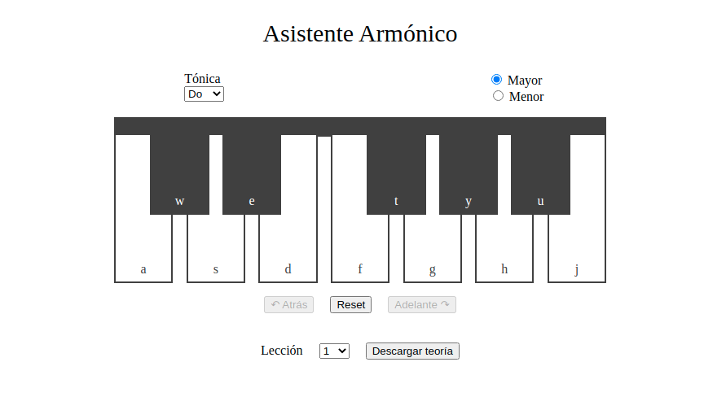

# Armonízame
[Music composition assistant](http://celrm.github.io/armonizame/) for harmonizations and chord choosing.

It contains references to **free music theory lessons** related to harmony (in Spanish), from http://haciendomusica.com/.

# Steps to use
1. Have a line of music that you want to harmonize.
2. Choose your key (*Tónica*) and mode (*Mayor/Menor*).
3. For each note in the line, press the corresponding piano key (mouse click or keyboard letter).
4. The chord options will appear below.
5. You may go back and forth along the line of music, or reset to introduce a new one.

You may also download the harmony lessons (*Descargar teoría*) one by one.
